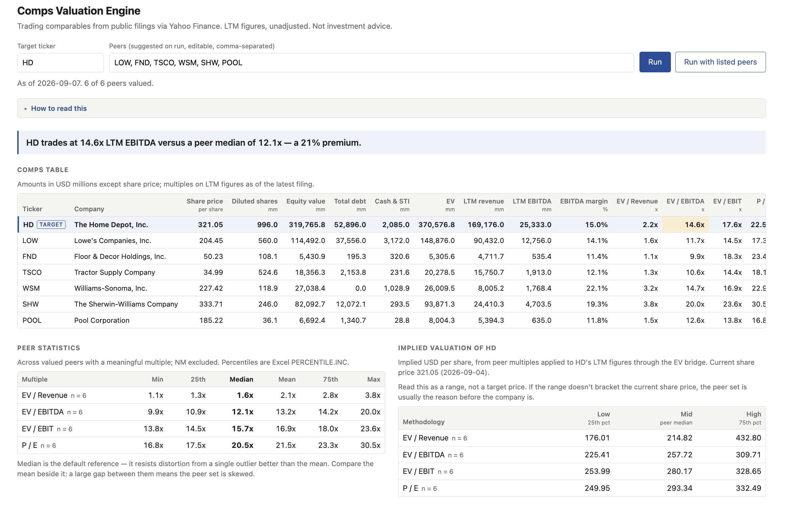

# Comps Valuation Engine

## What it does

Comparable-companies analysis over public data, as an API. Given a target, it gathers candidate peers from two sources, the compensation peer group the company discloses in its own proxy statement (filtered for business comparability) and a screen on the company's industry, and tags each name with the source(s) that suggested it; the user curates the list. It then pulls prices and statements from Yahoo Finance, builds each company's enterprise value and LTM multiples (EV/Revenue, EV/EBITDA, EV/EBIT, P/E), summarises the peer distribution, and applies them back to the target for an implied per-share range. Every approximation travels with the result as a data-quality flag; an unvaluable peer lands in a per-ticker errors map rather than failing the run. FastAPI, yfinance, TTL cache, single-file HTML frontend.



## EV bridge

```
Equity value     = diluted shares × share price
Enterprise value = equity value + total debt + preferred equity + noncontrolling interest
                   − cash and equivalents − short-term investments
```

Diluted shares are required; basic shares are a flagged fallback. Missing debt or cash counts as zero, flagged. The implied range runs the bridge in reverse; a company's own multiple recovers its own share price exactly.

## LTM methodology

LTM = the four most recent reported quarters; FY + current YTD stub − prior-year stub is also supported. EBITDA = LTM EBIT + LTM D&A; EBIT is operating income, D&A from the cash flow statement. Diluted EPS = (LTM net income − preferred dividends − income to noncontrolling interests) ÷ current diluted shares. A multiple is NM when its denominator is zero or negative, EV is negative, or EV/EBITDA exceeds 100x; NM values are excluded from statistics. Percentiles follow Excel's PERCENTILE.INC. Non-consecutive quarters, filings older than 135 days, and missing line items are flagged.

## UI

A single HTML file served at `/` by the same FastAPI app. Enter a target ticker and press Run: the page fetches candidate peers from `/api/peers`, fills the editable peers field with all of them, and posts the run to `/api/comps`. Two lines above the field describe the sources: the compensation peer group from the proxy statement (amber, linked to the filing, with how many names survived the filter) and the industry screen (grey). A Candidates list below the form shows every name with a Comp peers and/or Screen tag, names carrying both first, each with a remove/add control that edits the field; every name the filter removed from the proxy group is listed beneath it with its reason and an "add back" control. Curate, then use "Run with listed peers" to re-value against your own set; "Reset to suggested" puts every candidate back. "Download .xlsx" saves the run against the listed peers as a workbook (see the export endpoint under Setup).

The result opens with a one-line headline placing the target's EV/EBITDA against the peer median as a premium or discount. Below it, the comps table shows each company's share price, diluted shares, EV bridge, LTM revenue and EBITDA, margin, and the four multiples; the target row is shaded, and any target multiple outside the peer interquartile range is highlighted with the 25th or 75th percentile in its tooltip. Every column header carries a definition. Under the peer statistics and implied valuation tables, a football field draws the implied ranges: one bar per methodology from the 25th to the 75th percentile implied value per share, a tick at the median, and a labelled line at the current share price, with each row's n-count; a methodology that is NM is left out rather than drawn empty. It is plain SVG built in the page's own script, so the frontend stays a single file with no dependencies.

Peer statistics (min, quartiles, median, mean, max, with NM excluded and n shown per multiple) sit beside the implied per-share range, where low, mid, and high are the peer 25th percentile, median, and 75th percentile applied through the EV bridge. A data-quality section lists every flag by ticker and every peer that could not be valued, with the reason. A collapsible "How to read this" panel explains equity vs. enterprise value, numerator-denominator pairing, LTM, NM, and how to read the range.

## Peer selection

Candidates come from two sources, combined rather than ranked: the proxy-disclosed compensation peer group, filtered for business comparability, and an industry screen. The response is the union, each name tagged with the source(s) that suggested it, ordered with names in both sources first (the strongest signal the tool can give), then the rest of the proxy group in the filer's order, then the rest of the screen closest in size. Each source is described by its own label, and every unreadable filing, unmapped name, or removal is a flag.

**Proxy peer group.** Public companies disclose the peer group their compensation committee benchmarks against in the annual DEF 14A proxy statement. It is sourced to a filing, but it is chosen for pay benchmarking rather than valuation similarity: boards pick comp peers for revenue scale and competition for talent, so Nike's list holds Microsoft, Cisco, and Kimberly-Clark, and a median across them means nothing. The engine finds the latest DEF 14A through EDGAR's submissions API, converts the document to lines, and looks after each mention of a peer group for a run of consecutive lines that are company names in the SEC's company list, tolerating page headers and table columns and stopping at prose; a comma-separated list inside one sentence is tried when no table is found. Names map to tickers through the SEC list (legal suffixes and state-of-incorporation tags stripped, so "The TJX Companies, Inc." meets "TJX COMPANIES INC /DE/"); names that do not map (private, acquired, foreign) are returned in a flag, never dropped.

**Comparability filter.** A mapped name is kept only if it shares the target's sector (Yahoo's classification), its market cap sits inside the same 0.2x–5.0x band the industry screen uses, and its LTM EBITDA margin, the engine's own figure, is within 50% of the target's in relative terms (5.0%–14.9% for Nike's 9.9%; an absolute ten-point band admitted 0%–20%, which is most of consumer retail). The size test exists because boards pick compensation peers for revenue scale: Amazon is on Home Depot's list at roughly eight times its market cap, passed the sector and margin tests, and pulled the peer medians toward itself. The same band cuts the other way too: AutoZone sits on Home Depot's list at 0.16x of its market cap and Best Buy on Lowe's at 0.17x, and both are removed; each is one click from being added back. Names that cannot be valued (no data, no market cap, too few quarters, another currency) are removed too. Every removal is returned with its rule and reason, and a size removal states both market caps, the ratio, and the band. Survivors keep the filer's order. Confidence is high at eight or more mapped names, medium at four to seven, low below that; a low-confidence read, no filing, an unreadable list, EDGAR being down, or nothing surviving the filter all become flags, and the screen runs regardless. Nothing on this path raises.

**Industry screen.** Companies Yahoo classifies in the target's industry, market cap 0.2x–5.0x the target, same currencies, closest in size first. The band is wide because a tight one returns nothing for a large company in a thin industry: at 0.33x–3.0x, Nike's screen was empty. The sector is not used as a fallback: "Consumer Cyclical" puts restaurants and hotels next to a home-improvement retailer. A target Yahoo gives no industry at all is screened on its sector and flagged. A union of fewer than four names is flagged thin; a set of one is never returned unflagged. Thin results are expected and shown as such.

Live results (September 2026, 2026 proxies, all extracted at high confidence; target margins HD 15.0%, NKE 9.9%, LOW 14.1%, so the margin bands are 7.5%–22.5%, 5.0%–14.9%, and 7.1%–21.2%, and market caps $305bn, $55bn, $110bn, so the size bands are $61bn–$1.5tn, $11bn–$273bn, $22bn–$549bn):

| Target | Extracted from the proxy | Kept by the filter | Removed (reason) | Screen adds | Candidates shown |
|---|---|---|---|---|---|
| HD | AMZN, ROST, AZO, TGT, COST, KR, LOW, TJX, ORLY, WMT | ROST, LOW, TJX, ORLY | AMZN ($2.7tn market cap, 8.9x HD's, outside 0.2x–5.0x); AZO ($49bn, 0.16x); TGT, COST, KR, WMT (Consumer Defensive sector) | LOW | **LOW** (both), ROST, TJX, ORLY |
| NKE | BBY, MSFT, SBUX, CSCO, MDLZ, TGT, KO, NFLX, TJX, KMB, PEP, WMT, LOW, PG, DIS, MCD, CRM | BBY, SBUX, TJX, LOW | MSFT, CSCO, CRM (Technology); MDLZ, TGT, KO, KMB, PEP, WMT, PG (Consumer Defensive); NFLX, DIS (Communication Services); MCD (53.9% margin, outside 5.0%–14.9%) | none (DECK, at $10.9bn, sits just under the band's $10.9bn floor) | BBY, SBUX, TJX, LOW |
| LOW | BBY, COST, CVS, DG, NKE, SBUX, TGT, HD, KR, TJX, WMT; Walgreens Boots Alliance not mapped (private since 2025) | NKE, SBUX, HD, TJX | BBY ($19bn market cap, 0.17x LOW's, outside 0.2x–5.0x; its 6.2% margin would have failed too); COST, DG, TGT, KR, WMT (Consumer Defensive); CVS (Healthcare) | HD | **HD** (both), NKE, SBUX, TJX |

Note that Yahoo files discount stores and grocers under Consumer Defensive, so the sector test removes Target, Walmart, and Costco from a home-improvement retailer's list; they are one click from being added back. Nike's only screen match is Deckers, a fifth its size; the four proxy survivors are retailers.

## Why peer selection isn't automated

Both automated sources fail structurally, not from bad parameters.

Compensation peer groups are selected for executive pay benchmarking against companies of similar revenue scale and talent competition. Nike's proxy lists Microsoft and Cisco while omitting adidas, Puma, and Under Armour. Filtering a list like that for sector and margin removes the obvious non-comparables, but it cannot add a name the source never contained: Nike's filtered group is a handful of large retailers.

Industry screens return nothing useful for Nike because no US-listed footwear company sits within a sensible market-cap band of it; Yahoo's Footwear & Accessories holds six names besides Nike, the largest a fifth its size, and Lululemon and Under Armour are filed under other industries altogether. No classification system encodes which businesses are genuinely comparable.

The tool therefore assembles candidates from multiple sources, tags each with its provenance, shows what was dropped and why, links the source filing, and makes the list editable. The curation is the analyst's job; the tool's job is to make it cheap and auditable.

## Validation

The engine was tied line-by-line to a model built by hand from Home Depot's 10-Q (quarter ended 2026-08-02) and 10-K (FY2025), reproducing enterprise value of $370,576.8mm and EV/EBITDA of 14.628x exactly, pinned as `backend/tests/test_home_depot_golden.py`. A live test (`COMPS_LIVE_TESTS=1`) diffs Yahoo's current figures against it. The proxy parser is pinned offline against the peer-group sections of the HD, NKE, and LOW 2026 proxies as filed, and a live test re-reads them from EDGAR.

## Known limitations

- No adjustment for non-recurring items.
- LTM only, no forward estimates.
- No calendarization for non-December fiscal year ends.
- Yahoo's headline Total Debt bundles capitalized operating leases (62,567 vs. 52,896 for HD), so debt is built from component rows to stay consistent with unadjusted EBITDA.
- Filers that split tangible and intangible D&A require summing both cash-flow lines; the income-statement figure understates HD's EBITDA by roughly $850mm annually.
- Neither peer source is a peer set. Compensation peer groups reflect pay benchmarking rather than business similarity: Nike's filtered group is Best Buy, Starbucks, TJX, and Lowe's, and its real comparables were never on the list, because filtering cannot add names the source did not contain. Industry screens are too coarse: Yahoo's "Specialty Retail" spans auto parts and party supplies, and for HD the screen returns a single company. So the tool presents candidates from both, tagged by source, and expects the user to curate. Peer selection remains judgment.
- The screen is thin for a category leader even at 0.2x–5.0x. Yahoo's Footwear & Accessories holds six US-listed names besides Nike, the largest Deckers at $11bn against Nike's $55bn; Lululemon and Under Armour sit in other Yahoo industries (Apparel Retail, Apparel Manufacturing), adidas and Puma are not US-listed, and On and Birkenstock report in CHF and EUR. Nike's real comparables have to be typed in.
- The comparability filter on the proxy group is three blunt tests. Sector follows Yahoo's boundaries (retail is split between Consumer Cyclical and Consumer Defensive), the market-cap band removes a category leader's smaller comp peers along with the giants it was added for, and a relative margin band around a 10% target still admits most of consumer retail. Every removal is listed and one click from being added back.
- Proxy extraction parses prose with heuristics and will not read every filing. Failures are flagged and the screen still runs; a list the parser reads wrongly at medium or high confidence would not be caught, so check the linked filing when the set looks odd.
- Not investment advice.

## Setup

Requires Python 3.11+ and GNU Make.

```
make dev        # create backend/.venv, install, serve UI + API at http://127.0.0.1:8000
make test       # offline suite
make test-live  # also hits Yahoo Finance and SEC EDGAR
```

UI at `/`, docs at `/docs`. Endpoints: `GET /api/company/{ticker}`, `POST /api/comps`, `POST /api/comps/export`, `GET /api/peers/{ticker}`.

`POST /api/comps/export` takes the same body as `/api/comps` and returns the run as an `.xlsx` attachment named `{TICKER}_comps_{YYYY-MM-DD}.xlsx`, built with openpyxl. Four sheets, each with a frozen header row: Comps (the fifteen UI columns, target row first and shaded), Statistics (min, 25th, median, mean, 75th, max per multiple with n-counts), Implied (low, mid, high per share per methodology), and Sources (the as-of dates, the proxy filing URL, every candidate with its source tags and whether it was used, every name filtered out with its reason, names added by hand, every data-quality flag, and peers not valued). Figures are numbers with Excel formats, not formatted text: millions with thousands separators, multiples as 0.0x, margins as 0.0%, negatives in parentheses, NM as the text "NM".

Peer discovery reads SEC EDGAR, which requires a User-Agent naming the caller and a contact: set `COMPS_SEC_USER_AGENT="Your Name you@example.com"` (a placeholder is used otherwise). `COMPS_PROXY_PEERS=off` skips the proxy step and screens only.

## Deployment

Live at: **https://comps-valuation-engine.onrender.com** (placeholder; replace with the URL Render assigns).

The backend deploys to Render's free tier from `render.yaml` at the repo root, and serves the frontend itself, so there is one service. To deploy: fork or push the repo, then in the Render dashboard choose New → Blueprint, connect the repository, and apply. Render reads `render.yaml`, prompts for `COMPS_SEC_USER_AGENT` (the EDGAR contact string above), builds with `pip install ./backend` on Python 3.14.3 (the version pinned in the blueprint, matching `backend/.venv`), and starts uvicorn against `app.main:create_app` in factory mode on the port Render provides. Health checks hit `GET /api/health`. Every push to the default branch redeploys.

What to expect on the free tier:

- **Cold starts.** A free instance spins down after 15 minutes without traffic. The next request waits roughly a minute while it comes back; the UI's first Run after a quiet spell will sit on "Loading" for that long, and a `curl https://<your-url>/api/health` warms it up. Paid instances do not spin down.
- **The cache is in memory and per instance.** The lifespan wraps the yfinance provider in `CachedProvider` (prices refresh after 15 minutes, financials after 24 hours), and the service runs a single uvicorn worker, so repeat requests for a ticker are served from memory instead of re-fetching from Yahoo. A spin-down empties the cache, so the first run after a cold start fetches everything again.
- **Frontend location.** Installed into site-packages, the app cannot find `../frontend` by its own location, so the blueprint sets `COMPS_FRONTEND_DIR=frontend`, resolved against the repo root where Render runs the start command. Point it elsewhere if you move the frontend or set a `rootDir`; if the directory is missing the API still serves and `/` is a 404, with a warning in the logs.
- **Yahoo Finance from a shared IP.** Requests come from Render's address pool, so yfinance may be rate-limited more readily than from a laptop; the cache keeps that to the first request per ticker per TTL.
